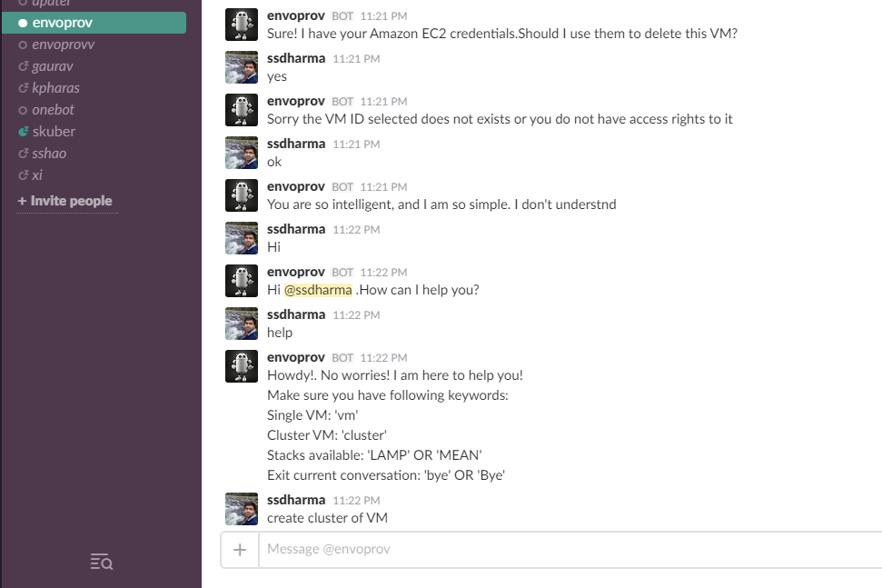

# Envoprov - Environment Provisioning Assistant bot

## Team

* Aniket Patel (apatel10)
* Gaurav Aradhye (garadhy)
* Kartikeya Pharasi (kpharas)
* Shruti Kuber (skuber)
* Subodh Dharmadhikari (ssdharma)

## Problem

Often creation of environments for different type of deployments such as production, testing, development, staging is a painstakingly long and manual process. In addition to this, if the deployment consists of a particular technology stack having multiple interconnected components, the configuration of such components has to be done by a knowledgeable person.

Also, configuration of the different components of technology stack is a manual process and due to the high probability of various dependencies being present, manual configuration can induce several errors, thus delaying the deployment. By automating this process, the entire process will be error free and faster.

## Solution

EnvoProv is a conversational bot which will assist the user to provision the machines on Amazon Web Services.

It assists the user by creating and provisioning required machines with the desired technology stack like LAMP and MEAN by obtaining the necessary details like configurations and necessary credentials from the user. The output that the bot provides to the user contain all the details of the provisioned machine that the user will need to access it and begin using it.

Since we are using AWS, it provides information something like the follwoing:

<pre>
Instance Id : i-9a9a9a99a9a
Public DNS Name: ec2-xxx-xxx-xxx-xxx.compute-1.amazonaws.com
Public IP: xxx.xxx.xxx.xxx
</pre>

This information will be helpful in accessing the machines for future use.

The bot thus, makes life easier for user to automate the process to create and install the software required and in less amount of time than the manual process.

The target audience we intend to cover with this bot can be a student who wants to go through less steps in creation, installation of softwares and mainitainance of any VM for academic purpose. It can also be used by a System Administrator, where he can request a sinlge VM on demand for his work or provision a cluster of VM based on demands of project for testing or new developemnt environment.

## Screenshots

The following screenshots demonstrates some basic conversation with _@envoprov_

* User can type in **help** to get basic commands the @envoprov can understand.

  

* A sample conversation to create a **single VM** on cloud can be seen below:

  

* A sample conversation to create a **cluster** of 3 VM (default number of machines in a cluster) can be seen below:

  

 * A sample conversation to **delete** a instance either a created as a single VM or as a part of cluster can be seen below:

  

## Primary Features

* Automated Cloud VM provisioning.
* Installation of requested software/ technology stack
* Ready-to-Deploy scripts for installation of bot.
* Integrate the bot with help of slackapp with any team.
* Easy to enter credentials of VM provider, use file upload feature to perform this action. User need not enter the credentials.
* Guide the user through the entire process with detailed instructions

## Reflection on Development process and project

#### Development and Deployment environment

 * _Slack_  - Bot hosting agent.
 * _EC2 Amazon Web Services_ - Bot hosting server.
 * _NodeJS_ - Development platform.
 * _mongoDB_ - Database for storage of user information.
 * _wit.ai_ - Natural Language Processing API for slack input processing.
 * _Chef_ - Internal Configuration Management tool to perform provisioning of technology stacks.
 * _Ansible_ - Configuration Management and Deployment tool to deploy the bot on any platform.

#### An overview of your whole development process: 

 We began from the basics learnt in the class workshops which involved us to develop a bot using Slack. Our project used a wide variety of technology stack ranging from Nodejs, Slack, AWS, Ansible, Chef and Witai. Beginning from the simple interaction of the bot using mock data we shifted to using MongoDB for storing our credentials, configurations and keys. The provisioning of the instances was done on AWS and the configuration of the stack was done using the Chef. This was implemented through the Chef servers using the cookbooks available. Finally we deployed our bot on an AWS instance and configured the same using Ansible.

## Limitations

* Limited to provisioning on AWS.
* Predefined technology stacks and software available for installation.

## Future Work

* Extend the provisioning to other cloud service providers. For e.g. Digital Ocean
* Support wide range of software to be installed. Extent provisioning of on the fly software packages.
* Provide a more secure way to handle service provider tokens.

## Demonstration Video [Link](https://youtu.be/AzfSQY2slm4?list=PLwmjVRRFEyJBHnXTYjiCU_K2LWgS93Q_Q)
